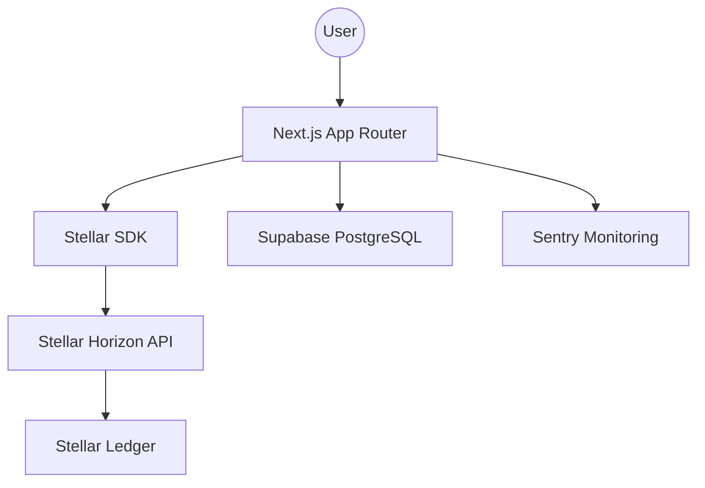

# TrustLand Technical Documentation

## 1. System Architecture

TrustLand utilizes a modern, serverless architecture optimized for high performance and blockchain integrity.



### Key Components:
- **Client-Side Hashing**: Documents are hashed using SHA-256 (Web Crypto API) in the user's browser. Original files are never transmitted.
- **Stellar Anchor**: Hashes are stored as `manageData` entries on the Stellar network.
- **Indexing Engine**: Successful transactions are indexed in Supabase for fast metadata retrieval and historical tracking.

## 2. API Reference

### Transactions API
`GET /api/transactions?wallet={address}&page={num}`
- **Description**: Returns transaction history for a specific wallet.
- **Response**:
  ```json
  {
    "transactions": [...],
    "pagination": { "total": 100, "page": 1, "pages": 5 }
  }
  ```

### Stats API
`GET /api/transactions/stats`
- **Description**: Returns global aggregate statistics.
- **Metrics**: Total Volume, Success Rate, 7-Day Growth.

## 3. Database Schema

### `profiles`
- `id`: UUID (Primary Key)
- `full_name`: String
- `wallet_address`: String (Unique)
- `referral_code`: String (Unique)

### `transactions`
- `tx_hash`: String (Unique)
- `user_id`: UUID (Foreign Key)
- `status`: String ('success', 'failed')
- `fee_sponsored`: Boolean

## 4. Fee Sponsorship (Fee Bump)

TrustLand implements **Stellar Fee Bump** transactions to provide a gasless experience.

**Workflow**:
1. User builds and signs a transaction with 0 fees.
2. The application wraps the transaction in a `FeeBumpTransaction` envelope.
3. The Sponsor Wallet signs the outer envelope and pays the XLM fees.
4. The transaction is submitted to Horizon.

## 5. Security Protocols
- **Rate Limiting**: 100 requests per minute per IP using Middleware.
- **Sanitization**: All user-provided metadata is sanitized via DOMPurify before storage.
- **Error Handling**: Custom error boundary and Sentry integration for real-time tracking.
